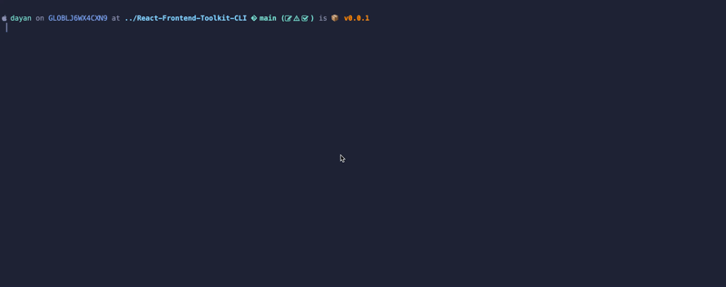
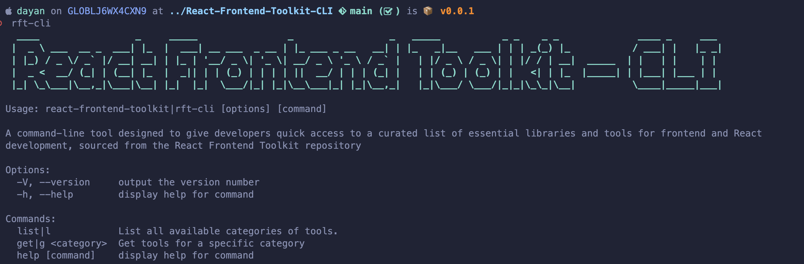

# 🛠️ React Frontend Toolkit CLI

<div align="center">
  


</div>

## ⭐ Star Us on GitHub

If you find this project helpful or interesting, please consider giving it a star on GitHub. Your support motivates us to keep improving and adding new features!

## 📢 Share

If you enjoyed this project, please share it with your friends and colleagues on social media:

<div align="center">

[](https://twitter.com/intent/tweet?text=Check%20out%20this%20awesome%20React%20Frontend%20Toolkit%20CLI!%20https%3A%2F%2Fgithub.com%2Fdrbarzaga%2FReact-Frontend-Toolkit-CLI)
[](https://www.facebook.com/sharer/sharer.php?u=https%3A%2F%2Fgithub.com%2Fdrbarzaga%2FReact-Frontend-Toolkit-CLI)
[](https://www.linkedin.com/shareArticle?mini=true&url=https%3A%2F%2Fgithub.com%2Fdrbarzaga%2FReact-Frontend-Toolkit-CLI&title=React%20Frontend%20Toolkit%20CLI&summary=Check%20out%20this%20awesome%20React%20Frontend%20Toolkit%20CLI!&source=LinkedIn)
[](https://www.reddit.com/submit?url=https%3A%2F%2Fgithub.com%2Fdrbarzaga%2FReact-Frontend-Toolkit-CLI&title=React%20Frontend%20Toolkit%20CLI)

</div>

Thank you for spreading the word!

## ℹ️ About

<div align="left" style="font-family: Roboto, sans-serif; font-size: 16px; line-height: 1.6;">

A command-line tool designed to give developers quick access to a curated list of essential libraries and tools for frontend and React development, sourced from the [React Frontend Toolkit](https://github.com/drbarzaga/React-Frontend-Toolkit) repository

</div>

## 🚀 Features

- **Category Search**: Instantly find recommended libraries for specific categories like `charts`, `state management`, `forms`, `hooks`, `animations` and more.
- **Quick Access**: Access essential information about each library, including a brief description and direct link to its documentation.
- **Easy to Use**: Simple commands to list available categories or get tools for a specific category, all from your command line.

## 📺 Demo

<div align="center">
  
</div>

## 🛠️ Installation

> <sub>[!WARNING] This package requires Node.js LTS version 20.9.0 or higher. Please ensure you have the correct version installed before proceeding with the installation. We recommend using a Node version manager like [NVM](https://github.com/nvm-sh/nvm) to easily switch between different Node.js versions.</sub>

To install the React Frontend Toolkit CLI, you can use npm or yarn:

### Using npm

```bash
$ npm install -g react-frontend-toolkit-cli
```

> or

### Using yarn

```bash
$ yarn global add react-frontend-toolkit-cli
```

## 🧪 Tests

```bash
$ npm run test
```

## 📚 Usage

Once installed, you can start using the CLI to find and access essential React libraries and tools. Here are some basic commands:

<div align="center">
  
</div>

### List Available Categories

To list all available categories of tools and libraries:

```bash
rft-cli list
```

### Get Tools for a Specific Category

To get a list of recommended tools for a specific category, use the following command:

```bash
rft-cli get <category>
```

Replace `<category>` with the desired category name, such as `charts`, `state management`, `forms`, etc.

### Example

```bash
rft-cli get charts
```

This command will display a list of recommended chart libraries along with brief descriptions and links to their documentation.

For more detailed usage instructions, please refer to the [official documentation](https://github.com/drbarzaga/React-Frontend-Toolkit-CLI#readme).

## 🧩 Contributing

Contributions are welcome! If you have any libraries or tools that you think should be included in this collection, feel free to open an issue or submit a pull request.

## 📃 License

This project is licensed under the MIT License. See the [LICENSE](LICENSE) file for more details.

## ✨ Acknowledgements

Special thanks to all the developers and contributors of this project. Your hard work and dedication make the React ecosystem better for everyone. We also extend our gratitude to those who have contributed to the development and improvement of this CLI tool. Your efforts are invaluable and greatly appreciated.

## 🤝 Contributors

Thanks to the following people who have contributed to this project:

<a href="https://github.com/drbarzaga/react-frontend-toolkit/graphs/contributors">
  
</a>

If you would like to contribute, please check out the [contributing guidelines](CONTRIBUTING.md).

## ❤️ Support

If you find this project interesting, please consider giving it a star ⭐ on GitHub. Your support is greatly appreciated!

You can also support me by buying me a coffee:

<div align="center">

[](https://ko-fi.com/dayanperez)

</div>

<div align="center">
  
</div>

## ✉️ Contact

If you have any questions, suggestions, or feedback, feel free to reach out:

- **Email**: [dayan.perez9012@gmail.com](mailto:dayan.perez9012@gmail.com)
- **Twitter**: [@dayanDev](https://twitter.com/dayanDev)
- **LinkedIn**: [Dayan Perez](https://www.linkedin.com/in/drbarzaga/)

We look forward to hearing from you!
