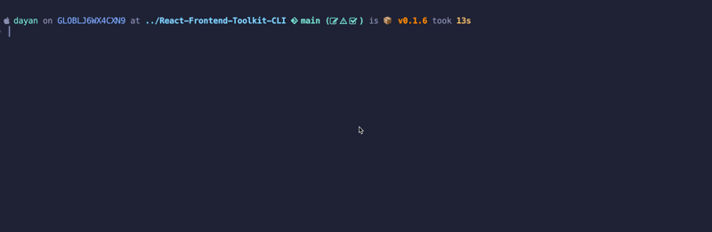

# React Frontend Toolkit CLI

A command-line tool designed to give developers quick access to a curated list of essential libraries and tools for frontend and React development, sourced from the [React Frontend Toolkit](https://github.com/drbarzaga/React-Frontend-Toolkit) repository

## Installation

> **Note:** Ensure you are using an LTS version of Node.js, recommended version 20.9.0.

To install the React Frontend Toolkit CLI, you can use npm, yarn or pnpm:

```bash
npm install -g react-frontend-toolkit-cli
```

```bash
yarn global add react-frontend-toolkit-cli
```

```bash
pnpm add -g react-frontend-toolkit-cli
```

## Usage

```bash
rft-cli <command> [options]
```

## Commands

- `list`: To list all available categories of tools and libraries.
- `get <category-name>`: To get a list of recommended tools for a specific category.

### Examples

- To list all available categories of tools and libraries:

```bash
rft-cli list
```

<div align="center">
  
</div>

- To get a list of recommended tools for a specific category, use the following command:

```bash
rft-cli get <category>
```

Replace `<category>` with the desired category name, such as `charts`, `state management`, `forms`, etc.

<div align="center">
  
</div>

### Options

- `-h, --help`: Display help for command.
- `-v, --version`: Output the version number.

## Contributing

Contributions are welcome! Please read the [contributing guidelines](CONTRIBUTING.md) first.

## License

This project is licensed under the MIT License. See the [LICENSE](LICENSE) file for details.

## Contact

If you have any questions, suggestions, or feedback, feel free to reach out:

- **Email**: [dayan.perez9012@gmail.com](mailto:dayan.perez9012@gmail.com)
- **Twitter**: [@dayanDev](https://twitter.com/dayanDev)
- **LinkedIn**: [Dayan Perez](https://www.linkedin.com/in/drbarzaga/)

We look forward to hearing from you!

## Start Us on Github

If you find this project helpful, please consider giving it a star on [GitHub](https://github.com/drbarzaga/React-Frontend-Toolkit-CLI). Your support is greatly appreciated ❤️!
